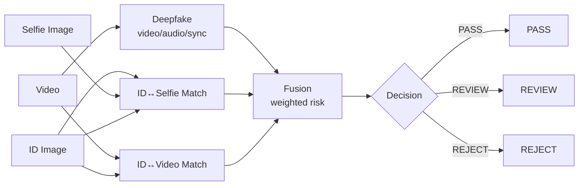

# eKYC Demo One-Pager

## 1) 系统结构图



## 2) /api/ekyc/evaluate（关键字段）

**Request (multipart)**  
`id_image`, `selfie_image`, `video`

**Response (JSON, key fields)**  
```json
{
  "deepfake": { "score": 0.82, "label": "Fake", "details": { "video": {}, "audio": {}, "sync": {} } },
  "match": {
    "id_selfie": { "ok": true, "score": 0.58, "prob": 0.79 },
    "id_video": { "ok": true, "score": 0.42, "prob": 0.60 },
    "best_video_frame_index": 123
  },
  "fusion": { "risk": 0.73, "decision": "REVIEW", "reason": ["Deepfake score high"] },
  "artifacts": {
    "id_face_path": "/storage/id_faces/xxx.png",
    "selfie_face_path": "/storage/selfie_faces/yyy.png",
    "video_best_frame_path": "/storage/video_frames/zzz.jpg"
  }
}
```

## 3) 融合规则与 Reason 触发

**权重与阈值**  
`risk = w1*deepfake_score + w2*(1-id_selfie_score) + w3*(1-id_video_score)`  
`w1=0.5, w2=0.25, w3=0.25`  
`PASS: risk < 0.4`  
`REVIEW: 0.4 ≤ risk < 0.7`  
`REJECT: risk ≥ 0.7`

**Reason 触发条件（示例）**
- `Deepfake score high`：`deepfake_score > 0.6`
- `ID vs selfie low`：`id_selfie_score < 0.6` 或 `id_selfie.ok=false`
- `ID vs video low`：`id_video_score < 0.6` 或 `id_video.ok=false`
- `All checks within threshold`：上述都未触发

## 4) quick_eval 场景矩阵 + 运行命令

**矩阵**  
- `pos`: `(id_i, selfie_i, video_i)`  
- `neg_id`: `(id_i, selfie_j, video_j)`  
- `neg_selfie`: `(id_j, selfie_i, video_j)`  
- `neg_video`: `(id_j, selfie_j, video_i)`  
`j = (i+1) mod N`

**运行**
```bash
python scripts/quick_eval_ekyc.py --data_dir data/quick_eval --out_dir outputs --base_url http://127.0.0.1:8000
```

## 5) 如何演示

1. 打开页面（`/` 或 `/static/index.html`）。  
2. 上传 **ID + Selfie + Video**，点击 **Evaluate eKYC**。  
3. 观察 **视频播放器 + 三张脸 + 三分数条 + decision/reasons**。  

**如何展示不是自证循环**  
跑 `quick_eval` 并展示 `outputs/quick_eval_results.csv` 的汇总统计（pos vs neg 的均值差异 + decision 分布）。
